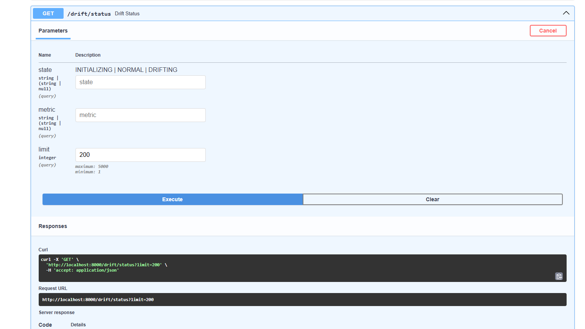
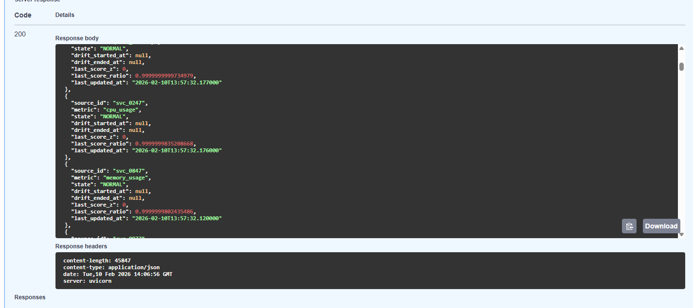
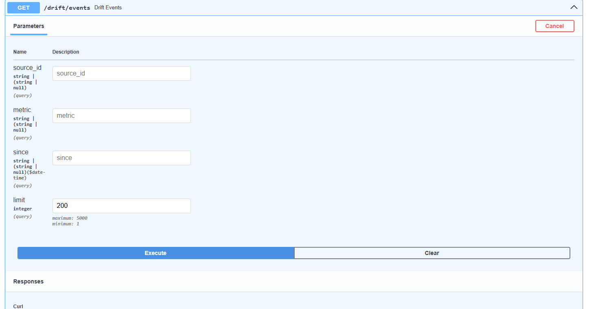
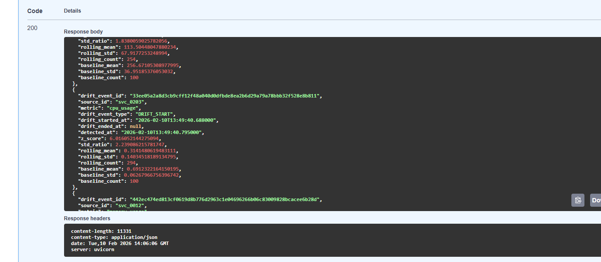

# Real-Time Drift Detection System

## System Overview

This project implements an **end-to-end real-time drift detection system** for telemetry metrics.  
It simulates how production monitoring systems detect **behavioral changes (drift)** in incoming data streams using historical baselines, rolling statistics, and sustained decision logic.

The system ingests events via Kafka, processes them in real time, stores raw and derived data in ClickHouse, manages configuration and baselines in PostgreSQL, exposes results via an API, and periodically updates historical baselines using Airflow.

The goal is to demonstrate **architecture, data flow, and drift detection logic**, not to build a fully production-hardened monitoring platform.

---

## Architecture

```
Kafka Producers
      │
      ▼
Kafka (telemetry.events)
      │
      ▼
ClickHouse (raw_events)
      │
      ├── Airflow (baseline aggregation → PostgreSQL)
      │
      ▼
Drift Detector Service
      │
      ├── PostgreSQL (thresholds, baselines, source metadata)
      ├── ClickHouse (drift_events, drift_status_current)
      │
      ▼
FastAPI (read-only monitoring API)
```

---

## Core Components

### 1. Kafka Producers

Three types of producers simulate different real-world behaviors:

- **Stable Producer**
  - Emits values with stable mean and variance
- **Dynamic Producer**
  - Emits values with slowly shifting distributions
- **Drift Producer**
  - Intentionally injects sudden distribution changes

Each event contains:

- `source_id`
- `metric`
- `value`
- `event_time` (ISO-8601)

All events are written to a single Kafka topic:

```
telemetry.events
```

---

### 2. ClickHouse Storage

ClickHouse is used for **high-throughput ingestion** and **analytical queries**.

#### Raw Events Table

```sql
raw_events
```

**Purpose:**

- Stores all telemetry events
- Acts as the immutable source of truth
- Supports fast aggregation for baseline computation

**Key columns:**

- `source_id`
- `metric`
- `value`
- `event_time`
- `ingest_time`
- `event_id` (deterministic hash for deduplication)

Data is ingested via a **Kafka Engine + Materialized View**.

---

#### Drift Events Table

```
drift_events
```

**Purpose:**

- Append-only log of drift transitions
- Stores both `DRIFT_START` and `DRIFT_END` events
- Designed to be idempotent via `drift_event_id`

Each row captures:

- Rolling statistics
- Baseline statistics
- Drift scores (z-score, std ratio)
- Detection timestamps

---

#### Drift Status (Current State)

```
drift_status_current
```

**Purpose:**

- Stores the latest drift state per `(source_id, metric)`
- Used by APIs and dashboards
- Implemented as `ReplacingMergeTree` to keep only the newest state

**Possible states:**

- `INITIALIZING`
- `NORMAL`
- `DRIFTING`

---

### 3. PostgreSQL Metadata & Configuration

PostgreSQL stores control-plane data.

#### Metric Thresholds

```
metric_thresholds
```

Defines drift sensitivity per metric:

- Rolling window size
- Minimum samples
- Z-score threshold
- Variance ratio threshold
- Sustained hit counts (enter / exit)

This allows metric-specific behavior.

---

#### Baseline Statistics

```
baseline_stats
```

Stores historical baselines per `(source_id, metric)`:

- Count
- Mean
- Standard deviation
- Time window

Baselines represent long-term historical behavior, not short-term noise.

---

#### Source Metadata

```
source_metadata
```

Tracks known sources:

- First seen
- Last seen
- Active/inactive status
- Source type (stable, dynamic, etc.)

This allows lifecycle tracking of producers.

---

## Drift Detection Logic

Drift is detected by comparing rolling window statistics against historical baselines.

### Rolling Statistics

For each `(source_id, metric)`:

- Maintained in-memory using a `deque`
- O(1) insert and eviction
- Event-time based windowing

**Computed metrics:**

- Rolling mean
- Rolling standard deviation
- Sample count

---

### Drift Scores

Two independent signals are used.

#### Mean Shift (Z-score)

```
|rolling_mean - baseline_mean| / baseline_std
```

#### Variance Shift (Std Ratio)

```
rolling_std / baseline_std
```

Drift is detected if either exceeds configured thresholds.

---

### Sustained Detection

To avoid noise:

- Drift starts only after **N consecutive violations**
- Drift ends only after **M consecutive normal evaluations**

State machine:

```
INITIALIZING → NORMAL → DRIFTING → NORMAL
```

---

## Drift Detector Service

The detector is a long-running Python service that:

- Loads thresholds and baselines from PostgreSQL
- Consumes events from Kafka
- Deduplicates events
- Handles late arrivals with per-key watermarks
- Maintains rolling statistics
- Detects drift transitions
- Writes results to ClickHouse

It refreshes configuration periodically without restart.

---

## Why `drift_controller` Exists

`drift_controller` sits between producers and the detector and is responsible for:

- Controlling when drift should be simulated
- Coordinating producer behavior
- Making drift scenarios reproducible and observable

This separation mirrors real systems where:

- Data producers are independent
- Control logic (experiments, simulations, rollouts) is centralized

It also allows:

- Cleaner testing
- Deterministic drift scenarios
- Easier extension of producer logic

---

## Airflow: Baseline Updates

Airflow is used to periodically update historical baselines.

### What the DAG Does

- Reads new data from ClickHouse (`raw_events`)
- Computes aggregate statistics per `(source_id, metric)`
- Updates PostgreSQL baselines using incremental aggregation
- Preserves full history influence (no daily reset)

This ensures:

- Baselines evolve slowly
- Short-term drift does not overwrite long-term behavior

---

## API Layer (FastAPI)

The API provides read-only access to system state.

### Key Endpoints

- `/health`  
  Connectivity checks for PostgreSQL and ClickHouse

- `/thresholds`  
  Current metric configuration

- `/baselines`  
  Historical baseline statistics

- `/sources`  
  Known sources and activity

- `/drift/status`  
  Current drift state per source/metric

- `/drift/events`  
  Historical drift transitions

The API is designed for dashboards and debugging, not writes.

---

## Demonstration-Oriented Design Choices

For clarity and reproducibility in a demo environment:

- Kafka topic count is limited
- Event schemas are simple and explicit
- Thresholds are intentionally easy to trigger
- Baselines update frequently
- Authentication and authorization are omitted

These choices make the system easy to reason about and test, while preserving the core architectural patterns used in real monitoring platforms.

---

## Summary

This project demonstrates how to build a streaming drift detection pipeline using:

- Kafka for ingestion
- ClickHouse for high-throughput analytics
- PostgreSQL for configuration and metadata
- Airflow for scheduled aggregation
- FastAPI for observability
- Python services for real-time detection

It showcases how rolling statistics, historical baselines, and sustained logic can be combined to reliably detect behavioral changes in streaming data.






